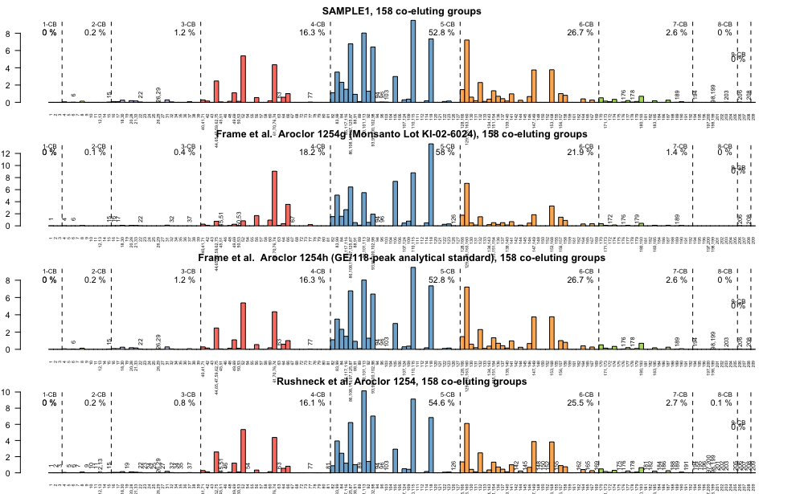

# `"CongeneR"`

`CongeneR` is a minimalist package that reconciles PCB congener data with different co-elution patterns

## Installation

Development version on [github](https://github.com/koshlan/CongeneR)
```ruby
# development version
library(devtools)

# install 'CongeneR'
install_github('CongeneR',  username='koshlan')
```

## Some Examples


```ruby
# The CongeneR package contains some example PCB congener samples (s1,s2,s3,s4) with different coelution patterns 
# generated with different columns 

# the object (r1) contains the reference aroclors referenced in Rushneck et al. 
# Dale R. Rushneck et al.  "Concentrations of dioxin-like PCB congeners in 
# unweathered Aroclors by HRGC/HRMS using EPA method 1668A"
# Chemosphere 54 (2004) 79-87	

#inspect data
head(s1)
head(r1)

# create
s1.elutions <- create_coelution_graph(s1)
r1.elutions <- create_coelution_graph(r1)

# unify
s1.r1.elutions <- unify_graphs(s1.elutions, r1.elutions)

# reaggregate
s1.unified <- aggregate_over_unified_coelutions(s1.elutions, s1.r1.elutions )                               
r1.unified <- aggregate_over_unified_coelutions(r1.elutions, s1.r1.elutions )

# merge 

# with reference aroclors from: 
# Geoge M. Frame et al. Complete PCB Congener Distributions for 
# 17 Aroclor Mixtures Determined by 3 HRGC Systems Optimized 
# for Comprehensive, Quantitative, Congener-Specific Analysis
# High Resolution Chromatography 19(12):657 - 668 · (1996)

s1.unifed.aroclors <- merge_with_coeluted_aroclors(results = s1.unified,
                                                   coelution_object = s1.r1.elutions,
                                                 database = "Frame")

r1.unifed.aroclors <- merge_with_coeluted_aroclors(results = r1.unified,
                                                   coelution_object = s1.r1.elutions,
                                                   database = "Frame")

# fingerprint 

# Plot a comparison of SAMPLE1 and Rushneck et al Chemosphere Standard, 
# co-eluted to be consistent with SAMPLE1-Rushneck elution patterns
par(mfrow = c(2,1))
fingerprint_plot(s1.unifed.aroclors, sample = SAMPLE1, main = "SAMPLE1")
fingerprint_plot_overlay(r1.unifed.aroclors, sample = R1254)
fingerprint_plot(r1.unifed.aroclors, sample = R1254, main = "R1254")

names(r1.unifed.aroclors)
# Plot multiple Frame Reference Aroclors co-eluted to be consistent with SAMPLE1-Rushneck elution patterns
par(mfrow = c(4,1), mar =c(2,2,2,2))
fingerprint_plot(s1.unifed.aroclors, sample = SAMPLE1,  main = "SAMPLE1, 158 co-eluting groups")
fingerprint_plot(r1.unifed.aroclors, sample = A1254g, main = "Frame et al.  Aroclor 1254g (Monsanto Lot KI-02-6024), 158 co-eluting groups")
fingerprint_plot(r1.unifed.aroclors, sample = A1254h, main = "Frame et al.  Aroclor 1254h (GE/118-peak analytical standard), 158 co-eluting groups")
fingerprint_plot(r1.unifed.aroclors, sample = R1254, main = "Rushneck et al. Aroclor 1254, 158 co-eluting groups")

# Plot multiple Rushneck Reference Aroclors co-eluted to be consistent with SAMPLE1-Rushneck elution patterns
par(mfrow = c(5,1), mar =c(2,2,2,2))
fingerprint_plot(s1.unifed.aroclors, sample = SAMPLE1,  main = "SAMPLE1, 158 co-eluting groups")
fingerprint_plot(r1.unifed.aroclors, sample = R1242, main = "Rushneck et al. Aroclor 1242, 158 co-eluting groups")
fingerprint_plot(r1.unifed.aroclors, sample = R1248, main = "Rushneck et al. Aroclor 1248, 158 co-eluting groups")
fingerprint_plot(r1.unifed.aroclors, sample = R1254, main = "Rushneck et al. Aroclor 1254, 158 co-eluting groups")
fingerprint_plot(r1.unifed.aroclors, sample = R1260, main = "Rushneck et al. Aroclor 1260, 158 co-eluting groups")
fingerprint_plot(r1.unifed.aroclors, sample = R1262, main = "Rushneck et al. Aroclor 1262, 158 co-eluting groups")
```

Author Contact
--------------
[www.pgwg.com](http://www.pgwg.com/staff_key.html)
